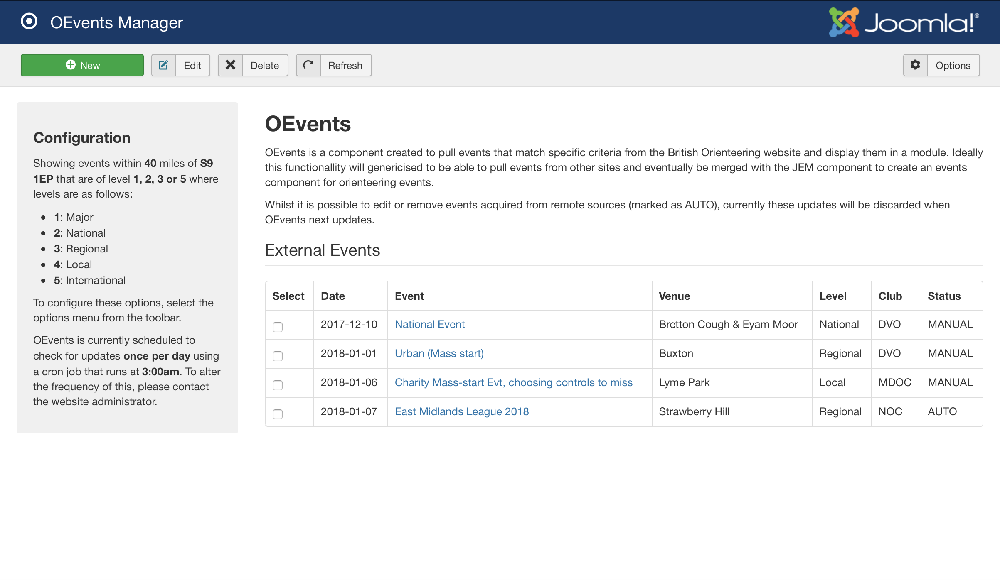

# OEvents Joomla Package

A simple Joomla package that periodically crawls the [British Orienteering events page](https://www.britishorienteering.org.uk/event) to scrape details of events that match the specified criteria. It is also possible to manually add events and to delete and edit existing events. A module is provided to display these events on the front-end of a Joomla website. 

This component is not intended as a full-on event management system, there are other Joomla components that manage this, such as [JEM](https://www.joomlaeventmanager.net). 

## Installation
1) Clone this repository
2) Run the `create_install_package.sh` script to create the following zip files: `com_ovents.zip`, `lib_oevents.zip`, `mod_oevents_external.zip` and `pkg_oevents.zip`
3) Make a note of the generated token details
4) Install using Joomla 
    1) Extensions -> Manage -> Install
    2) Upload package file and point to the `pkg_oevents` file 
5) Schedule cron-job to automated the refresh of matching events (details below)

## Usage

### Component
The OEvents component only provides a back-end view for managing events. Here, a user can manually add events, trigger a search for new events matching the given criteria on the British Orienteering website and delete or edit existing events. 



### Module
The OEvents module is how the events are displayed to the users of your website. Simply configure the module in the same way all Joomla modules are configured and it will show any events discovered/added by the OEvents component.

### Automated Refresh
To enable automated refreshing of events that match your criteria, OEvents exposes a simple client-side view that can be called to trigger a refresh. A [cron-job](https://en.wikipedia.org/wiki/Cron) can be set up to trigger a call to this view on given schedule. The command below shows a way that this could be done using cURL: 

```bash
curl "https://www.example.com/?option=com_oevents&task=refresh" >/dev/null 2>&1
```

Please do not excessively execute this refresh procedure as it would result in unnecessary traffic to the British Orienteering website. Refreshing once per day should be sufficient.

#### Security
To reduce the chance that this exposed view is triggered by a third-party, the OEvents component requires that any requests to the aforementioned URL are accompanied with a valid token. This security check is performed in the `com_oevents/site/controller.php` file. The salt and password defined in this file need to match with those defined in the cURL command.

As part of the install/package script (`create_install_package.sh`), the default values of the salt and password are replaced by randomly generated alternatives. These new values for the salt and password are printed to screen such that they can be used in the cURL command.

For additional security the day of the year is appended to the generated password. The cURL command should also do this so it is aligned with what the code is expecting. All in all, an example of the cURL command to be used can be found below: 

```bash
curl --data "quay=$(openssl passwd -1 -salt someRandomSalt someRandomPassword$(date '+%-j') | cut -d '$' -f 4)" "https://www.example.com/?option=com_oevents&task=refresh" >/dev/null 2>&1
```

## TODO
 - Add an option to specify own salt and password on install/package
 - Make use of `sed` backup to restore original salt & password after package has been created so future package commands still replace these values
 - Embed the scheduled refresh into the component rather than requiring an external cron-job to be set-up

## Bugs
 - Several warning messages are printed to the main OEvents manager page in the administrator section of the site after a clean install. Don't go away when there are events present
    - These are because the event level option default doesn't apply until it is saved by the user...
 - Salt replacing during packaging seems to be working, but not password
 - cURL command is correct, but not being executed...
 - When events are updated automatically, the level is `COM_OEVENTS_EVENT_LEVEL_`
