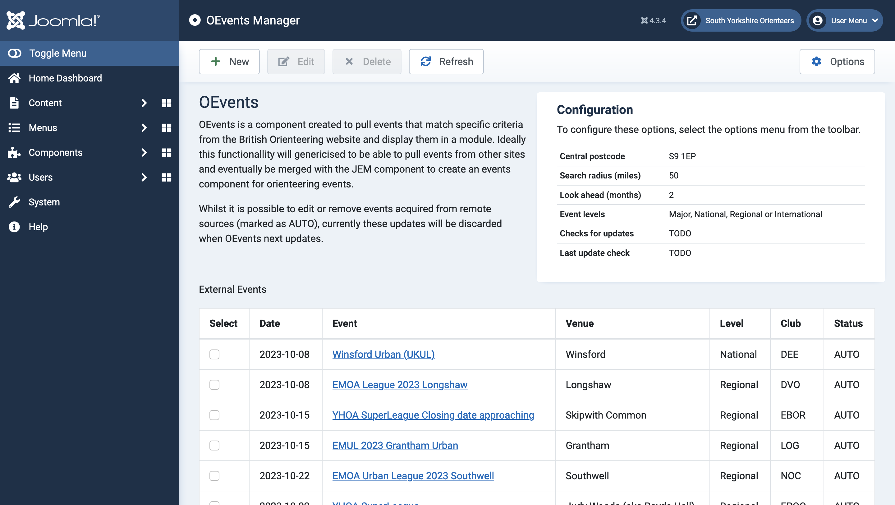

# OEvents Joomla Package

A simple Joomla package that periodically crawls the [British Orienteering events page](https://www.britishorienteering.org.uk/event) to scrape details of events that match the specified criteria. It is also possible to manually add events and to delete and edit existing events. A module is provided to display these events on the front-end of a Joomla website. 

This component is not intended as a full-on event management system, there are other Joomla components that manage this, such as [JEM](https://www.joomlaeventmanager.net). 

## Requirements
* Joomla 4.2+
* PHP 8.2+

## Installation
1) Clone this repository
2) Run the `create_install_package.sh` script to create the following zip files: 
    * `com_ovents.zip`
    * `lib_oevents.zip`
    * `mod_oevents_external.zip`
    * `plg_task_oevents_updater.zip`
    * `pkg_oevents.zip`
3) Install using Joomla 
    1) System -> Install -> Extensions
    2) Upload package file and point to the `pkg_oevents` file 
4) Enable the OEvents Updater plugin
5) Use the Joomla 4 "Scheduled Tasks" functionality to automate the checking for new events (details [below](#automated-refresh)).

## Usage

### Component
The OEvents component only provides a back-end view for managing events. Here, a user can manually add events, trigger a search for new events matching the given criteria on the British Orienteering website and delete or edit existing events. 

### Module
The OEvents module is how the events are displayed to the users of your website. Simply configure the module in the same way all Joomla modules are configured and it will show any events discovered/added by the OEvents component.

### Automated Refresh
To enable automated refreshing of events that match your criteria, OEvents includes a plugin that is compatible with Joomla 4's "Scheduled Tasks" functionality. 

To setup this functionality, go to System -> Manage -> Scheduled Tasks -> New -> Update OEvents and select how often you would like to check for new events. 

Please be considerate when choosing a refresh time as it would result in unnecessary traffic to the British Orienteering website. Refreshing once per day should be sufficient.

## TODO
 - Add namespacing to component
   - The refresh button on the component backend does not work because of this
 - Add namespacing to module

## Bugs
 - Several warning messages are printed to the main OEvents manager page in the administrator section of the site after a clean install. Don't go away when there are events present
    - These are because the event level option default doesn't apply until it is saved by the user...
 